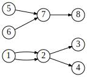
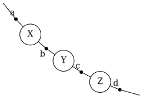
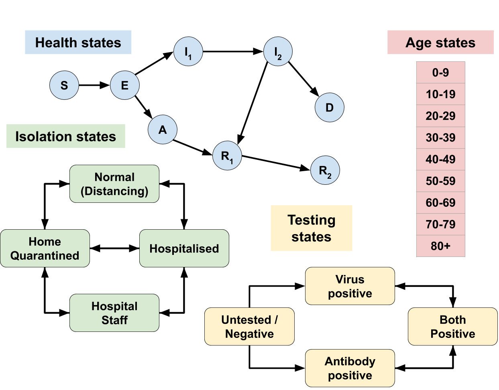
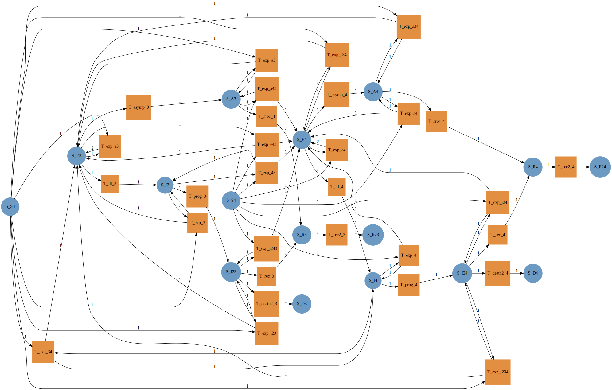

class: title, no-footer


.two-line[


# Compositional epidemiological modeling <br/> using structured cospans


]


.two-line[


## Micah Halter and Evan Patterson <br/> with James Fairbanks


]


### November 16, 2020


---


# Compositional scientific modeling


  * Applied category theory promises to reduce complexity and boost engineering efficiency through *compositionality*
  * Contemporary scientific models can be extremely large and complex, but they are usually built out of simpler pieces
  * **Our goal**: Build ACT software that makes it easier to compose scientific models


---


# Outline


1. C-sets in Catlab
2. Structured cospans of C-sets
3. Structured multicospans and undirected wiring diagrams
4. Petri nets as C-sets
5. COEXIST model of COVID-19


**For background**, watch last week's talk by John Baez on the mathematics of structured cospans and whole-grain Petri nets.


---


# C-sets


**Recall**: Given a small category $\mathcal{C}$, a *$\mathcal{C}$-set* is a functor $\mathcal{C} \to \mathbf{Set}$. <br/> A $\mathcal{C}$-set is also called a "copresheaf on $\mathcal{C}$."


**Example**: The *schema for graphs* is the category $\mathcal{C}$ generated by


A $\mathcal{C}$-set is then a *graph*, aka a "directed multigraph."


---


class: compact col-2


# C-sets in Catlab


In Catlab, a $\mathcal{C}$-set is a functor $\mathcal{C} \to \textbf{FinSet}$.


  * Finite sets are identified with $\\{1,\dots,n\\}$ (we work in the skeleton of $\mathbf{FinSet}$)
  * Functions are vectors of integers
  * Preimages ("indexes") are stored for fast lookups, e.g. of edges incident to a vertex


From a software perspective, $\mathcal{C}$-sets are like in-memory databases.


<br> <br>


```julia
using Catlab, Catlab.CategoricalAlgebra

@present SchemaGraphs(FreeSchema) begin
  V::Ob
  E::Ob
  src::Hom(E,V)
  tgt::Hom(E,V)
end

const Graph = CSetType(SchemaGraphs,
                       index=[:src, :tgt])

g = Graph()
add_parts!(g, :V, 3)
add_parts!(g, :E, 2, src=[1,2], tgt=[2,3])
g
```

<div class="c-set">
<span class="c-set-summary">CSet with elements V = 1:3, E = 1:2</span>
<table>
  <tr class = "header headerLastRow">
    <th class = rowNumber>E</th>
    <th style = "text-align: right; ">src</th>
    <th style = "text-align: right; ">tgt</th>
  </tr>
  <tr>
    <td class = rowNumber>1</td>
    <td style = "text-align: right; ">1</td>
    <td style = "text-align: right; ">2</td>
  </tr>
  <tr>
    <td class = rowNumber>2</td>
    <td style = "text-align: right; ">2</td>
    <td style = "text-align: right; ">3</td>
  </tr>
</table>
</div>


---


# Morphisms of C-sets


**Recall**: A *morphism of $\mathcal{C}$-sets* $X \to Y$ is a natural transformation $\phi: X \to Y$: a family of functions $\phi_c: X(c) \to Y(c)$, $c \in \mathcal{C}$, satisfying the naturality equations.


Categories of $\mathcal{C}$-sets are very nice: they are "combinatorial toposes."


Implemented in Catlab:


  * Morphisms of $\mathcal{C}$-sets
  * (Co)limits of fixed shape: (co)products, pullbacks, pushouts
  * (Co)limits of arbitrary shape


---


class: compact col-2


# Attributed C-sets


What about data outside of `FinSet{Int}`, say in $\mathbb{R}$?


  * Edge weights in graphs
  * Rates in Petri nets


For this, Catlab supports *attributed $\mathcal{C}$-sets*, which can be formalized in several ways:


  * As functors $\mathcal{C} \to \mathbf{Set}$, like before, but fixed at certain objects
  * As transformations out of a profunctor $\mathrm{Attr}: \mathcal{C} \to \mathsf{Data}$ (cf. [Schultz et al 2017](http://www.tac.mta.ca/tac/volumes/32/16/32-16abs.html) on "algebraic databases")


```julia
@present SchemaWeightedGraphs <: SchemaGraphs begin
  Real::Data
  weight::Attr(E,Real)
end

const WeightedGraph = ACSetType(
  SchemaWeightedGraphs, index=[:src, :tgt])

g = WeightedGraph{Float64}()
add_parts!(g, :V, 2)
add_parts!(g, :E, 3, src=1, tgt=2,
           weight=[0.25, 0.5, 0.75])
g
```

<div class="c-set">
<span class="c-set-summary">ACSet with elements V = 1:2, E = 1:3</span>
<table>
  <tr class = "header headerLastRow">
    <th class = rowNumber>E</th>
    <th style = "text-align: right; ">src</th>
    <th style = "text-align: right; ">tgt</th>
    <th style = "text-align: right; ">weight</th>
  </tr>
  <tr>
    <td class = rowNumber>1</td>
    <td style = "text-align: right; ">1</td>
    <td style = "text-align: right; ">2</td>
    <td style = "text-align: right; ">0.25</td>
  </tr>
  <tr>
    <td class = rowNumber>2</td>
    <td style = "text-align: right; ">1</td>
    <td style = "text-align: right; ">2</td>
    <td style = "text-align: right; ">0.5</td>
  </tr>
  <tr>
    <td class = rowNumber>3</td>
    <td style = "text-align: right; ">1</td>
    <td style = "text-align: right; ">2</td>
    <td style = "text-align: right; ">0.75</td>
  </tr>
</table>
</div>


---


# Morphisms of attributed C-sets


Usually prefer a restricted notion of *morphism of attributed $\mathcal{C}$-set*: natural transformations $\phi: X \to Y$ such that


$$
\phi_d = 1_D \qquad\text{where}\qquad D := X(d) = Y(d)
$$


for all data objects $d \in \mathcal{C}$.


Similarly to slice categories:


  * colimits are the same
  * limits are different but still exist


---


# Structured cospans


Structured cospans model *open systems* ([Baez & Courser 2020](https://arxiv.org/abs/1911.04630)).


**Definition**: Given a functor $L: \mathcal{A} \to \mathcal{X}$, a *structured cospan* is a cospan in $\mathcal{X}$ of form


where $a,b \in \mathcal{A}$ and $x \in \mathcal{X}$.


---


class: col-2


# Two forms for structured cospans


The functor $L: \mathcal{A} \to \mathcal{X}$ usually has a right adjoint $R: \mathcal{X} \to \mathcal{A}$.


**"$L$-form"**: objects $a,b \in \mathcal{A}$ and cospan in $\mathcal{X}$ of form


**"$R$-form"** similar to *decorated cospan* ([Fong 2015](http://www.tac.mta.ca/tac/volumes/30/33/30-33abs.html)): object $x \in \mathcal{X}$ and cospan in $\mathcal{A}$ of form


---


# Structured cospans of C-sets


**Construction**: Take the *discrete $\mathcal{C}$-set functor*


$$
L: \mathcal{A} \to \mathcal{X}, \qquad
L(A)(c) := \begin{cases}
  A &\text{if $c = c_0$} \\\
  \emptyset &\text{otherwise}
\end{cases}
$$


where


  * $\mathcal{A} = \mathbf{FinSet}$
  * $\mathcal{X} = \mathcal{C}\text{-}\mathbf{FinSet}$ for some small category  $\mathcal{C}$
  * $c_0$ is an object in $\mathcal{C}$ with no outgoing morphisms.


Right adjoint $R: \mathcal{X} \to \mathcal{A}$ is the *forgetful functor* $X \mapsto X(c_0)$.


---


class: compact col-2


# Open C-sets


An *open $\mathcal{C}$-set* is a structured cospan for such a functor $L$.


**Example**: In *open graphs* take $c_0 = V$, so that the functor $L: \mathbf{FinSet} \to \mathbf{Graph}$ is


$$
\begin{aligned}
  L(A)(V) &= A \\\
  L(A)(E) &= \emptyset.
\end{aligned}
$$


In code, we usually specify open $\mathcal{C}$-sets in $R$-form.


<br> <br>


```julia
const OpenGraphOb, OpenGraph =
  OpenCSetTypes(Graph, :V)

x = Graph(4)
add_edges!(x, [1,1,2,2], [2,2,3,4])

M = OpenGraph(x, FinFunction([1], 4),
              FinFunction([3,4], 4))

gv = show_graphviz(apex(M))
```


```julia
Tuple(feet(M))
```


```
(FinSet(1), FinSet(2))
```


---


class: compact col-2


# Open C-sets as a hypergraph category


The usual operations are supported:


  * composition, via pushout
  * monoidal product, via coproduct
  * identity, braiding, ...


```julia
y = Graph(4)
add_edges!(y, [1,2,3], [3,3,4])

N = OpenGraph(y, FinFunction([1,2], 4),
              FinFunction([4], 4))
```


<br>


```julia
using Catlab.Theories

P = M⋅N
```


```julia
Q = M⊗N
```





---


class: compact col-2


# Biased vs unbiased notions of composition


Decorated/structured cospans are usually viewed as hypergraph categories or symmetric monoidal double categories.


  * These structures are **biased**: defined by a finite set of primitive operations of fixed arity ($\circ$ and $\otimes$ are binary operations)
  * They are also **directed**: inputs are distinguished from outputs


While mathematically convenient, both cause practical difficulties:


  * Compositions must be decomposed into primitives, either

      * by hand, which is tedious and error prone, or
      * algorithmically, which is complicated and slow
  * Directionality is artificial: must deal with cups and caps


---


# The operad of undirected wiring diagrams


*Operads* solve the first problem, and the *operad of undirected wiring diagrams* ([Spivak 2013](https://arxiv.org/abs/1305.0297)) solves both problems.


<small>(Outer ports of UWDs are drawn as dangling wires.)</small>


---


# The operad of undirected wiring diagrams


A UWD represents a general composition in a hypergraph category.


UWDs are the natural unbiased syntax for:


  * tensor networks
  * conjunctive queries of relational DBs
  * formulas in regular logic ([Fong & Spivak 2018](https://arxiv.org/abs/1812.05765))
  * composites of multispans or multicospans
  * composites of structured multicospans


---


class: compact col-2


# Undirected wiring diagrams as C-sets


**Definition**: An *(untyped) UWD* is a $\mathcal{C}$-set for the category $\mathcal{C}$ generated by


A *typed UWD* is a UWD with compatible typings of ports and junctions.


<br> <br>


```julia
@present SchemaUWDs(FreeSchema) begin
  Box::Ob
  Port::Ob
  OuterPort::Ob
  Junction::Ob

  box::Hom(Port, Box)
  junction::Hom(Port, Junction)
  outer_junction::Hom(OuterPort, Junction)
end

@present SchemaTypedUWDs <: SchemaUWDs begin
  Type::Data

  port_type::Attr(Port, Type)
  outer_port_type::Attr(OuterPort, Type)
  junction_type::Attr(Junction, Type)

  junction ⋅ junction_type == port_type
  outer_junction ⋅ junction_type ==
    outer_port_type
end
```


---


# Structured multicospans


**Definition**: Given a functor $L: \mathcal{A} \to \mathcal{X}$, a *structured multicospan* is a diagram in $\mathcal{X}$ of form


where $a_1,\dots,a_n \in \mathcal{A}$ and $x \in \mathcal{X}$.


Structured multicospans (or their isomorphism classes) are an *algebra* of the operad of $\mathcal{A}$-typed UWDs.


---


class: col-2


# Composing structured multicospans


Any undirected wiring diagram typed by objects in $\mathcal{A}$...


...specifies a diagram in $\mathcal{X}$ over which to take a colimit.


---


class: compact, col-2


# Structured multicospans in Catlab


Define UWDs using the `@relation` macro:


```julia
uwd = @relation (a,d) where (a,b,c,d) begin
  X(a,b)
  Y(b,c)
  Z(c,d)
end

gv = show_graphviz(uwd)
```





Compose according to UWD-algebra using `oapply` function:


```julia
P = oapply(uwd, [N, M, N])

graph = apex(P)
gv = show_graphviz(graph, node_labels=false)
```


---


class: compact col-2


# Petri nets as attributed C-sets


Schema for Petri nets as C-sets ([Kock 2020](https://arxiv.org/abs/2005.05108)) with attributes for labels, rate constants, and initial concentrations:


```julia
@present TheoryReactionNet(FreeSchema) begin
  T::Ob
  S::Ob
  I::Ob
  O::Ob

  Name::Data
  Rate::Data
  Concentration::Data

  it::Hom(I,T)
  is::Hom(I,S)
  ot::Hom(O,T)
  os::Hom(O,S)

  tname::Attr(T, Name)
  sname::Attr(S, Name)
  rate::Attr(T, Rate)
  concentration::Attr(S, Concentration)
end
```


???


Extend the definition of whole-grain petri nets


Attributes for labels on both states and transitions


Attributes for initial concentrations on states (natural numbers)


Attributes for rates on transitions (positive real numbers)


We refer to these as reaction networks


In Catlab, the morphisms of C-set Petri nets are natural transformations but in the colimits we use for structured cospans, all the morphisms involved are actually etale maps, as described by Kock.


---


class: compact


# Epidemiology primitive reactions


All basic epidemiological models can be constructed from two basic primitives


```julia
const LabelledRxNet = LabelledReactionNet{Number,Int}

spontaneous = LabelledRxNet((:I=>10,:R=>0), (:rec=>.25,:I=>:R))
```


```julia
transmission = LabelledRxNet((:S=>100, :I=>10, :E=>0), (:exp=>.9, (:S,:I)=>(:E,:I)))
```


???


Basic epidemiology models can be build from two basic primitives


A spontaneous change in a state (i.e. recovery, disease progression, etc.)


A state causing another to change (i.e. infection, exposure, etc.)


  * In the case of infection the first state is changed to become the infection state that is causing it to change


Explain the notation/API for defining these blocks


Define these primitives using helper functions that make it easy to make different versions


---


class: compact


# Epidemiology theory


```julia
@present Epi(FreeHypergraphCategory) begin
    (S,E,I,R,D)::Ob

    infection::Hom(S⊗I, I)
    exposure::Hom(S⊗I, E)
    illness::Hom(E,I)
    recovery::Hom(I,R)
    death::Hom(I,D)
end

sir = Epi[:infection] ⋅ Epi[:recovery]
```


<br>  


???


Explain the theory and the available Homs


Describe how each hom is an example of one of the two primitive reactions


describe the sir model created with composition and the resulting wd/petri net


describe how the fuctor is defined as a dictionary of what primitive cospan you want to want to replace each hom with


---


class: compact col-2


# Directed vs undirected composition


```julia
seir = @program Epi (s::S, i::I) begin
  e = exposure(s,i)
  i2 = illness(e)
  r = recovery([i,i2])
  return r
end
```


 <br> <br> <br> <br>


```julia
seir = @relation (s,e,i,r) begin
    exposure(s,i,e)
    illness(e,i)
    recovery(i,r)
end
```


???


Describe SEIR model, exposure phase before illness


Two methods of constructing these models


  * Either as directed wiring diagrams using structured cospans and the `@program` macro
  * Or undirected using the `@relation` macro and resource sharing


In the undirected wiring diagram instead of cospans we have multispans where each leg points to one state


In the undirected wiring diagram, you don't have to worry about merging and copying and in the case of petri nets it is easier to make models because they operate on resource sharing


Explain difference in SEIR model definition, keeping track of 2 `I` wires and merging them


---


# Hierarchically defined models


```julia
sir = @relation (s, i, r) begin
    infection(s, i)
    recovery(i, r)
end
```


 


???


Next we are looking at using this operadic approach to define models hierarchically


Reintroduce SIR model defined as an undirected wiring diagram


Notice here we are using regular whole-grain petri nets, so no labels, concentrations, or rates


More on that decision soon


---


# Hierarchically defined models


```julia
dual_sir = @relation (s, i, i2, r) begin
    sir(s, i, r)
    sir(s, i2, r)
end
```


 


???


We can now take this operad and treat it as a new primitive


Create a dual SIR model with mutually exclusive infections with shared immunity


Common in modeling seasonal flu


  * many strains
  * different enough to have unique dynamics
  * but similar enough to cause shared immunity


We can do this easily because we are using regular Petri nets


As we encode more information into the types such as labels, rates, and initial conditions we have to get more specific with the model definition


The more information described in the schema or theory, the more tight the semantic checking is


Here both `i` and `i2` are the same type `I`, but in a schema with labels and rates, this is not true


Once this model is defined here, we would be expected to provide parameters post-hoc when we attempt to generate a simulator using a plethora of methods ODE, SDE, Gillespie simulation


---


# Hierarchically defined models


```julia
dual_sir2 = @relation (s, i, i2, r) begin
    sir1(s, i, r)
    sir2(s, i2, r)
end
```


 


???


Describe the reaction net equivalent


We need 2 different SIR models, they have the same structure but different conditions and rates in the attributes


When we type check we don't only check that the objects are the same but that all of the attributes are equal


This allows you to get domain specific knowledge checked by the type system during model construction


It can verify if you accidentally try to create a model where the populations you are composing aren't compatible more fine grained than just they are both infected populations


Useful that this framework is contained within the Julia programming language because you can create helper functions that aren't necessarily functorial or compositionally defined that allow you to easily re-parameterize models with the same structure


An added benefit of tracking initial conditions and rates through the model construction is the ability to immediately be able to generate a simulator for a large, complex model without having to think about which parameters go where in a big model after composition


---


class: img-right .footer[


  * *Image from COEXIST repository*


]


# COEXIST model





An extension of an SEIR model to better represent what we know about how COVID-19 ([GitHub](https://github.com/gbohner/coexist)):


  * An asymptomatic state
  * Two stages of infection based on antibody development
  * Two stages of recovery based on presence of antibodies
  * Sub-states for different testing, isolation, and age groups


???


COEXIST model used to model COVID and is used by UK for guiding policy decisions


An extension of an SEIR model (as shown before) but with extra structure to capture how we have learned that COVID works


Explain states that are different


Explain the meta states, testing, social distancing, age groups all cause changes in transition rates in the model


For this example we are only implementing a small piece of this, which is the basic health model with different age groups


---


# Defining the model compositionally


```julia
coexist = @relation (s, e, i, i2, a, r, r2, d) begin
    exposure(s, i, e)
    exposure_i2(s, i2, e)
    exposure_a(s, a, e)
    exposure_e(s, e, e)
    asymptomatic_infection(e, a)
    asymptomatic_recovery(a, r)
    illness(e, i)
    progression(i, i2)
    death(i2, d)
    recovery(i2, r)
    recover_late(r, r2)
end
```


???


describe relation block and all of the reactions needed to define the model


all of these have been defined as one of the two primitive reactions with more added to capture the new structure and dynamics


Because we are able to reduce all of these models down to some composition of those primitive operations defining what these reactions mean is both easy and allows the scientist to be able to correctly build their model on the first try


---


# COEXIST undirected wiring diagram


???


We are using Graphviz to display the operads and sometimes for complex undirected wiring diagrams its hard to get the layout right with a random seed


---


# COEXIST Petri net


???


The model is more clear when we use `oapply` to construct the petri net that this system describes


Each box is replaced with the corresponding primitive petri net and they are pieced together compositionally


With this epidemiology model defined, we want to extend it to model different age groups


---


# Modeling cross-exposure


```julia
crossexposure = @relation (s, e, i, i2, a, r, r2, d,
                           s′, e′, i′, i2′, a′, r′, r2′, d′) begin
    exposure(s, i′, e)
    exposure_i2(s, i2′, e)
    exposure_a(s, a′, e)
    exposure_e(s, e′, e)
    exposure′(s′, i, e′)
    exposure_i2′(s′, i2, e′)
    exposure_a′(s′, a, e′)
    exposure_e′(s′, e, e′)
end
```


???


Explain the relation described here


we have two sets of population veriables representing two different age groups


each age group can expose the other


---


# Cross-exposure Petri net


???


Describe the resulting Petri net


States with no transitions are the recovered dead states where they play no role in the exposure process


---


class: compact col-2


# Multi generational COEXIST model


```julia
twoNCoexist = @relation (pop1, pop2) begin
    crossexp12(pop1, pop2)
    coex1(pop1)
    coex2(pop2)
end
```





???


Here we can put these models together compositionally


Describe the wire bundling, group populations together into a single wire which now instead of a single scalar represents a vector


Resulting petri net is very large and hard to understand quickly


Even with just two populations this would be a hard petri net to define and parameterize


We can quickly and easily build up more populations


---


class: compact


# Simulating the system


```julia
tspan = (0.0, 100.0)
prob = ODEProblem(vectorfield(twoNCoexist_petri), concentrations(twoNCoexist_petri),
                  tspan, rates(twoNCoexist_petri))
sol = solve(prob, Tsit5())
```


???


Simulating the model become very easy since we keep track of labels, rates, and initial concentrations


We have functions for generating vector field function to provide to Julia's differential equations package


helper functions to get the vector of concentrations and rates of the final model


---


class: compact


# Simulating different intervention methods


<br> <br>


 


???


Since the construction of the model is separate from the primitive reactions we can easily redefine the primitive reactions with different rates and use functor to get several different models


Here we are decreasing the exposure rates in the model to represent social distancing policy enforcement and we can see that the curve is flattened and the peaked is delayed


Notice the total number of infected and recovered doesn't change because we have no vaccination modeling or immunity factored in


These changes merely slows down the infection and flattens the curve


It would be easy to add a state for vaccination as a single other transition and state that would allow us to model that very rapidly


---


class: compact img-right


# Acknowledgements


<br> DARPA Awards:


  * Artificial Intelligence Exploration: Automating Scientific Knowledge Extraction (ASKE)
  * Young Faculty Award: Model Aware Scientific Computing (MASC)
  * Generalized Algebraic Theories for Enhancing Multiphysics (GATEM)
  * Artificial Social Intelligence for Successful Teams (ASIST)

